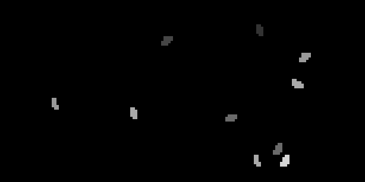
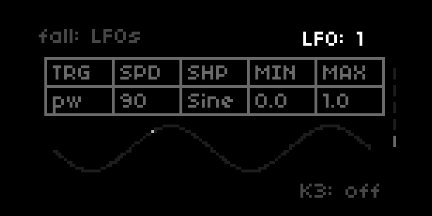

## Fall



### About

Norns generative script that makes melodies based on falling leaves. Includes a simple sound engine and MIDI support.

### Demo

Made with Blooper and Vongon Ultrasheer to add extra layers:

* [SoundCloud demo](https://soundcloud.com/ambalek/fall4)
* [Short video](https://www.instagram.com/p/CUNoNHHAlzn/)

### Installation

```
;install https://github.com/ambalek/fall
```

For help, check out the [thread on Lines](https://llllllll.co/t/fall-generative-synth-sequencer/48991).

### Controls

* Key 2: Randomize current scale
* Key 3: Stop and generate a new scale/melody
* Enc 1: Change screen
* Enc 2: Add/remove leaves
* Enc 3: Cycle attack/release values

### Grid


Tap the first 7 rows to add leaves, and use the last row to remove leaves. Leaves fade away over a short time so you have time to tap them before they disappear.

### Screens

1. Falling leaves
2. Scale options
3. Sound options
4. Delays
5. LFOs

### LFOs



There are three LFOs. The LFO options include:

* Pulse width
* Attack
* Release
* Long delay time (quantized)
* Short delay time (quantized)

All the LFOs are off by default.

The LFOs are sine, square, sample and hold (random). To use the LFO menu, Enc 2 changes the selected option and Enc 3 changes the value. Key 3 toggles LFOs on and off.

### MIDI and other options

For MIDI and full control over all the parameters that drive the script, use Key 1 to go to the Norns menus then go to PARAMETERS, EDIT.

### Contributions

* linusschrab: crow output
* pfig: fix typo
* zebra: tempo tip https://llllllll.co/t/fall-generative-synth-sequencer/48991/49

### License

MIT
